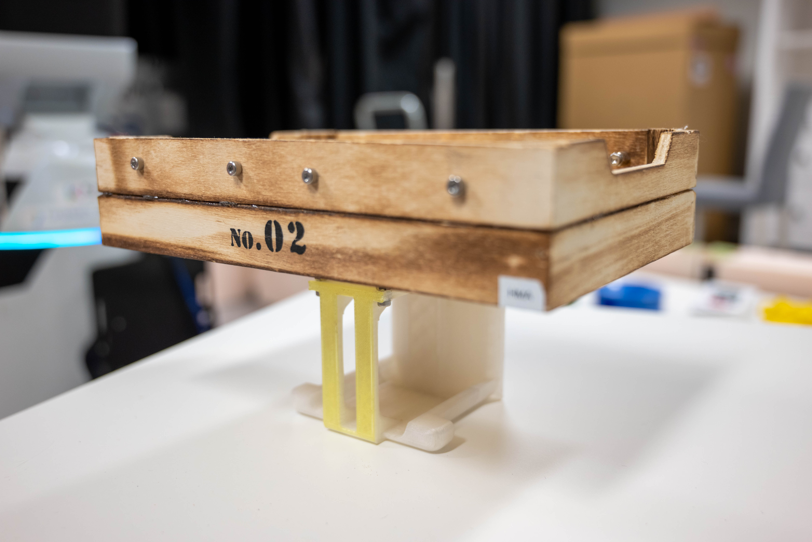
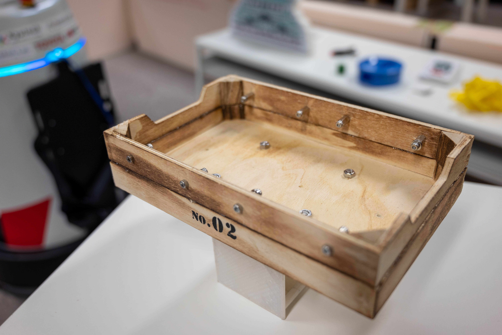
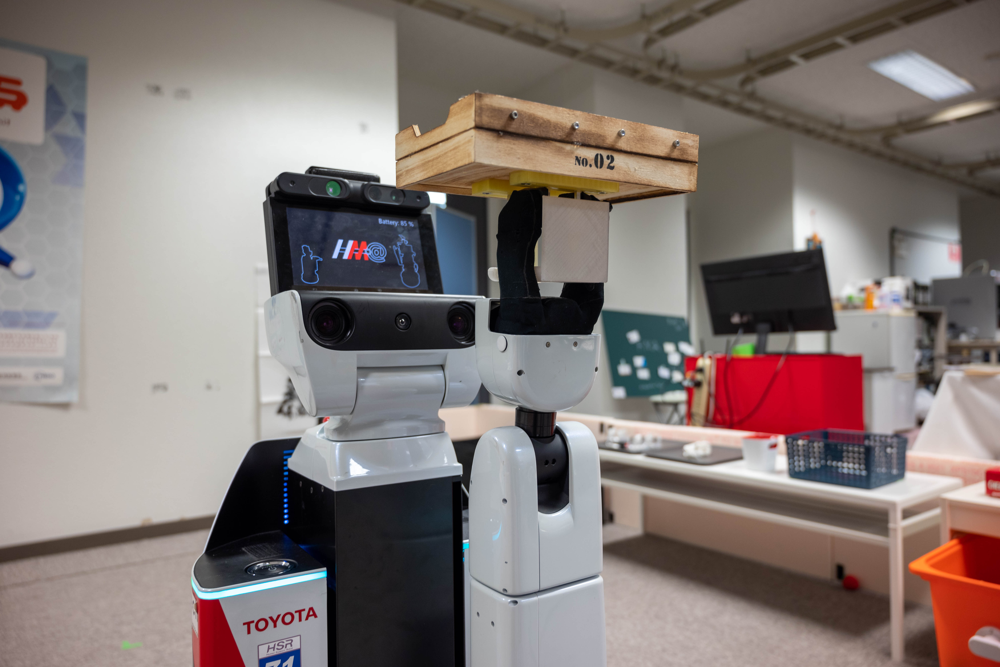

# Restaurant
このタスクでは，ロボットはレストランのウエイターとして働く．ロボットは未知環境内で，クライアントのオーダーを取り，配膳する必要がある．

## メインゴール
クライアントのオーダーを取り，配膳する．

## フォーカス
このタスクでは，オンラインマッピング，未知環境でのナビゲーション，ジェスチャー，言葉による対話，タスクプランニング，マニピュレーションに焦点を当てている．

## セットアップ
- ロケーション: 現実のレストラン環境か，それに近い未知環境が用意される．本タスクではアリーナはそのまま使われない．
- スタートロケーション: ロボットはキッチンバーの隣からスタートする
- クライアント: プロフェッショナルクライアント（観客・TCから選ばれた，チームメンバーでない人間）が着席するテーブルが少なくとも3つ用意され，少なくとも2つのオーダーが用意される（少なくとも2回分のオーダーが準備される．例えば3オブジェクトのオーダーが1つと，2オブジェクトのオーダーが1つ）．
- キッチンバー: レストランのキッチン（または，そのように定義される場所）の近くにテーブルが用意され，カウンターのように使用される．
- バーマン: プロフェッショナルバーマン（TCから選ばれた，チームメンバーでない人間）が，キッチンバーの反対側でロボットを待つ．彼の役割はロボットのオーダーを受け，ロボットに指示を出すことである．
- オブジェクト: オーダーを満たすオブジェクトを含む複数のオブジェクトがキッチンバーに並べられる．

## シナリオ
### a. スタートフェーズ
1. 配置: レフェリーは，チームにロボットをスタート位置へ移動させるよう指示する．
1. スタート: レフェリーはスタートの合図を出し，タイマーをスタートさせる．同時にチームは最後の簡単なセットアップ（スタートボタンを押す等）を完了し，エリアを離れる．この際，ボタンを2つ以上押すなど複雑なセットアップ手順の実施は認められない．また，これ以後チームがロボットに触れると即座に失格になる．

### b. オーダーフェーズ
オーダーフェーズ，デリバリーフェーズは2回繰り返される．すなわちロボットは2回，オーダーを取り配膳することができる．
1. クライアントが手を降り，ウエイターを呼ぶ．ロボットは自身が呼ばれていることに自分で気付かなくてはならない．
1. ロボットは呼ばれていることに気が付くと，バーマンにその旨を伝え，自身がオーダーを取りに行って良いか確認しなくてはならない．許可された場合は3へ，不許可な場合は1へ戻る．
1. ロボットは自身を呼ぶクライアントの元へ移動する
1. ロボットはクライアントからオーダーを取る．オーダーされるオブジェクトの数は最大3つである．この時，ロボットは自身が覚えた注文を発話して「正しくオーダーが取れたこと」を示さなければならない．
1. ロボットはキッチンバーに移動し，バーマンにオーダーを伝える．

### c. デリバリーフェーズ
1. ロボットはキッチンバーに置かれている複数のオブジェクトから，オーダーされたオブジェクトを把持します．ロボットは必要に応じて，ロボット本体に未接続のト
1. レイ（カスタムコンテナ）を使用することが許可されます．
1. ロボットはクライアントの元へ移動します．
1. ロボットはオブジェクトをクライアントへ配達する．この時，ロボットはクライアントのテーブルへオブジェクトを置かなければペナルティとなる．
1. ロボットはバーマンの元へ戻る．1回目の場合「b. オーダーフェーズ」へ戻る．2回目の場合，ここでタスクは終了である

## カスタムコンテナ
ロボットはオブジェクトをデリバリーするために，トレイやカスタムコンテナを使用することが出来る．カスタムコンテナを使用することのみを理由に得点は減じられない．

<table>
<tr>
  <td>
    
  </td>
  <td>
    
  </td>
  <td>
    
  </td>
</tr>
<tr>
  <td colspan="3">
  

   カスタムコンテナの一例（左，中：カスタムコンテナ本体，右：HSRが持っているところ）
  

  </td>
</tr>
</table>

## デウスエクスマキナ
本タスクでは，次のデウスエクスマキナが採用される．デウスエクスマキナでは該当アクションの点数は入らないが，より簡単な手法でアクションをスキップし，タスクを継続することができる．

| Action | Bypassing |
| --- | --- |
| 手を振るクライアントを検出する | ✓ クライアントにARマーカーを持たせる   ✓ バーマンがクライアントを指さす |
| オーダーを取るためにクライアントのテーブルまで移動する | ✓ バーマンがテーブルまで歩いていく（ロボットはバーマンに追従する）   ✓ バーマンがロボットの手を引く |
| 正しくオーダーを取る | ✓ QRコードにより注文を伝える |
| オーダーを伝えるためにバーマンの元へ戻る | （オーダーを取るためにクライアントのテーブルまで移動する）と同じ |
| オーダーされたオブジェクトを把持する・獲得する（ロボットに接続されないトレイを使用可能） | ✓ バーマンがトレイに物体を乗せる |
| オブジェクトをデリバリーするためにクライアントのテーブルへ到達する | （オーダーを取るためにクライアントのテーブルまで移動する）と同じ |

## スコアシート
| Action | Bypassing |
| --- | --- |
| 手を振るクライアントを検出する | 100×2 |
| オーダーを取るためにクライアントのテーブルまで移動する | 100×2 |
| 正しくオーダーを取る | 100×2 |
| オーダーを伝えるためにバーマンの元へ戻る | 100×2 |
| バーマンに正しくオーダーを伝える | 100×2 |
| オーダーされたオブジェクトを把持する・獲得する（ロボットに接続されないトレイを使用可能） | 100*×2 |
| オブジェクトをデリバリーするためにクライアントのテーブルへ到達する | 100*×2 |
| クライアントへオブジェクトを配達する | 100*×2 |
| *ペナルティ* | 　 |
| オーダーを取る際にクライアントの方向を向いていない | -50×2 |
| オブジェクト配達時，ロボットがテーブルへオブジェクトを置いていない | -50×2 |

＊: オブジェクトを全て操作すると満点となる．オーダーが複数のオブジェクトを含む時，オーダーに含まれるオブジェクト数と，操作したオブジェクト数の割合に応じた得点が加算される（オーダーが2つのオブジェクトを含む時に1つだけ把持すると，1/2の点数である50点が加算される）